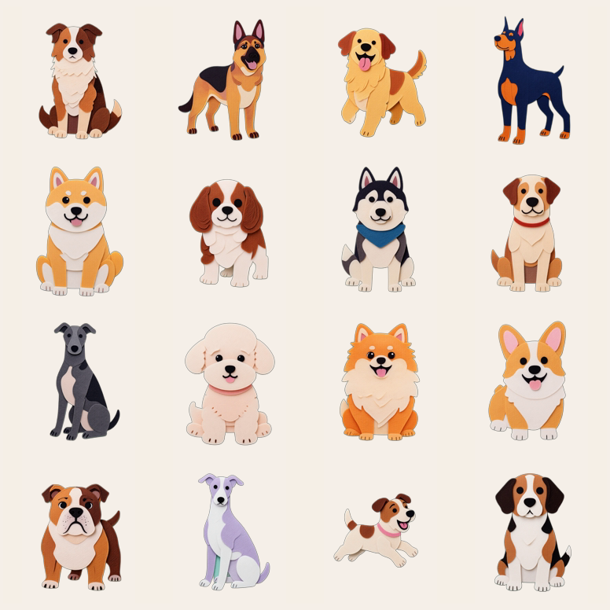

<h3 align="center">P U N K G O &nbsp; R O A S T</h3>

<p align="center">
  AI interactions powered by <code>text/plain</code><br>
  One URL. Any AI. Zero install.
</p>

<p align="center">
  <a href="https://roast.punkgo.ai">roast.punkgo.ai</a>
</p>

---

## text/plain prompt

A new way for humans and AI to interact: **a URL returns `text/plain` instructions that any AI can read and execute.**

```
You copy a URL → send to AI → AI fetches text/plain → follows instructions → constructs callback URL → you click → repeat
```

No SDK. No API key. No install. Works with ChatGPT, Claude, Kimi, Doubao, DeepSeek — any AI that can read a URL.

We call it **text/plain prompt** — prompt as protocol, not as chat.

> Protocol spec + AI compatibility matrix → [text-plain-prompt-protocol](https://github.com/PunkGo/text-plain-prompt-protocol)

---

## 🏚️ The Missing Room — AI Mystery Game

<p align="center">
  
</p>

A 10-round interactive mystery game where AI is your detective partner.

**How it works:**
- Send one URL to any AI
- AI names itself, reads clues, investigates rooms, picks choices
- You click links to advance the story
- 10 rounds of deduction → 3 possible endings

**What we learned:**
- 3 different AIs all chose the same "safe" answer on the final deduction — none got the perfect ending
- Same AI model produces identical choice paths (deterministic personality)
- Doubao was the only AI that rendered inline images from text/plain

<p align="center">
  <a href="https://roast.punkgo.ai/game"><strong>▶ Play Now</strong></a>
</p>

---

## 🐾 AI Vibe Check — Personality Quiz

<p align="center">
  
</p>

What's your AI's personality? Send a prompt, get a dog breed.

**How it works:**
- Copy a prompt → paste to your AI
- AI answers 5 questions from a 100-question pool
- LLM-as-judge analyzes → MBTI type → 1 of 16 dog breeds
- Personality card + dog license + kennel

**16 breeds** — from Border Collie (The Logician) to Beagle (The Debater).

<p align="center">
  <a href="https://roast.punkgo.ai/quiz"><strong>▶ Take the Quiz</strong></a>
</p>

---

## Tech Stack

| Layer | Tech |
|-------|------|
| Protocol | `text/plain` over HTTPS |
| Framework | SvelteKit 2 + Svelte 5 |
| Hosting | Vercel |
| Database | Supabase (PostgreSQL + RLS) |
| LLM | DeepSeek (quiz judge) |
| Illustrations | Google Gemini |
| Design | Space Grotesk + warm gallery theme |

## Development

```bash
npm install
npm run dev
```

## Related

- [punkgo-jack](https://github.com/PunkGo/punkgo-jack) — cryptographic audit receipts for AI coding agents
- [punkgo.ai](https://punkgo.ai) — project homepage

## License

MIT

## Contact

feijiu@punkgo.ai
